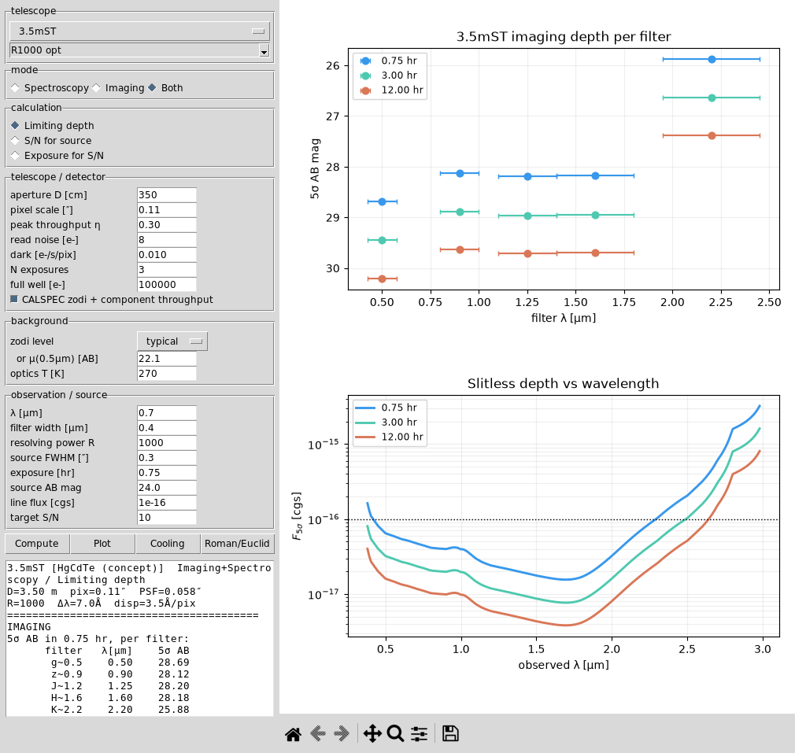

# Space ETC — imaging & slitless spectroscopy



A wavelength-resolved exposure-time / depth calculator for a wide-field space
telescope, written for the 3.5 m segmented-mirror R=1000 cosmology proposal but
usable for any aperture. Fidelity target is a Euclid/Roman/Pandeia-class ETC.

## Modes and calculations
- **Spectroscopy** (slitless emission line), **Imaging** (broadband point source), or
  **Both** at once (the output and the plot split into an imaging and a spectroscopy panel).
- **Limiting depth** (Nσ line flux or AB magnitude), **S/N for a source**, and
  **exposure time for a target S/N** — all invertible.
- **Telescope aperture is an input** (any diameter), as are R, pixel scale,
  throughput, read noise, dark, number of exposures, and full well.
- **Telescope presets** (JWST NIRCam SW/LW, Roman WFI, Euclid, 3.5mST) auto-fill the
  aperture and the real detector specs (H4RG-10 / H2RG read noise, dark current,
  full well, pixel scale, band cutoff), from the mission technical documentation.
- **Filter / disperser dropdown** per telescope (Roman F062…F213, JWST F070W…F444W,
  Euclid Y/J/H, grisms/prisms) sets the central wavelength, bandwidth, and R.
  In imaging mode the limiting depth is reported and plotted **per filter**.

## What it models
- **Zodiacal background as a spectrum** — the real STScI CALSPEC solar reference
  scattered by interplanetary dust, reddened ~0.3 mag in (V−K) after Leinert
  et al. 1998, plus the interplanetary-dust thermal term. Pointing set by a
  low/typical/high zodi level.
- **Telescope thermal self-emission** (graybody) → a near-IR "thermal wall" whose
  onset moves with the optics temperature (cooling tradeoff).
- **Wavelength-dependent throughput and detector QE** — e2v CCD (optical) and
  Teledyne H2RG HgCdTe (near-IR) blended through a 1.0 µm dichroic.
- **Full per-pixel noise budget** — source shot + sky + dark + read (ramp) +
  optional flat-field residual, over the line/aperture footprint. The noise and
  saturation model follows the Pandeia engine (Pontoppidan et al. 2016).
- **Saturation** — brightest source before the central pixel reaches full well.
- Exact Nσ depth by solving the quadratic (source shot noise retained).

## Galaxy templates and redshift photometry
- `make_galaxy_templates.py` uses **FSPS** to generate 10 diverse galaxy SEDs (E, S0,
  Sa--Sd, Irr, starburst, dusty starburst, quiescent) with nebular emission, saved under
  `galaxy_templates/` so the ETC is standalone (no FSPS needed to run).
- `galaxy_etc.py` redshifts a template, normalises it to an absolute magnitude, and returns
  the observed AB magnitude per filter vs redshift (k-correction + distance modulus) and the
  exposure time to a target S/N. `MV_LEVELS` spans giant galaxies down to dwarfs.
- `make_galaxy_demo.py` plots mag-vs-z (per filter, per type) and hours-to-5σ-vs-z.

## Files
| file | purpose |
|---|---|
| `slitless_etc.py` | the calculator (depth, S/N, exposure, saturation, Roman/Euclid cross-check, cooling) |
| `etc_gui.py` | Tk (Tcl/Tk) GUI front-end |
| `make_etc_data.py` | builds the CALSPEC-solar zodiacal spectrum and component QE/throughput CSVs |
| `etc_zodi.csv`, `etc_qe.csv`, `etc_throughput.csv` | generated input curves |
| `etc_f5sigma.png`, `etc_cooling.png` | example outputs |
| `Makefile` | `make data`, `make gui`, `make run`, `make figures`, `make clean` |

## Quick start
```bash
make data           # regenerate zodi/QE/throughput curves (downloads CALSPEC solar)
make gui            # launch the Tk GUI
make run            # CLI: full run + Roman/Euclid cross-check + cooling tradeoff
python slitless_etc.py --R 1000 --pix 0.11 --realistic --cooling
```
Dependencies: `numpy`, `scipy`, `matplotlib`, `astropy` (CALSPEC download), plus
`tkinter` for the GUI. Override the interpreter with `make PYTHON=/path/to/python`.

## Validation
Run on the published Roman and Euclid grism parameters, the calculator reproduces
the Roman HLSS depth (1×10⁻¹⁶ erg s⁻¹ cm⁻² at 6.5σ; Wang et al. 2022) to ~5% and
the Euclid Wide depth (2×10⁻¹⁶ at 3.5σ; Euclid prep. XXX 2023) to a factor of two.

## References
Leinert et al. 1998 (A&AS 127, 1); Pontoppidan et al. 2016 (Pandeia, SPIE 9910);
Wang et al. 2022 (ApJ 928, 1); Euclid Collaboration, Euclid preparation XXX 2023
(A&A 676, A34); solar spectrum: STScI CALSPEC `sun_reference_stis_002`.
